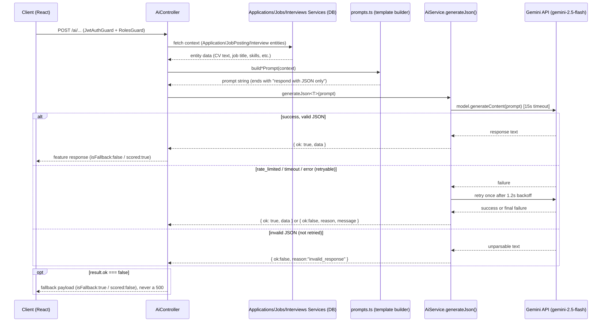

# TalentBridge — System Architecture Report

**Date:** 2026-07-14

---

## 1. Entity-Relationship (ER) Diagram

All `*.entity.ts` files found under `backend/src/modules/**`: `applications/entities/application.entity.ts`, `auth/entities/refresh-token.entity.ts`, `interviews/entities/interview.entity.ts`, `jobs/entities/job-posting.entity.ts`, `offers/entities/offer.entity.ts`, `users/entities/user.entity.ts`. No `notifications` entity exists — the notifications module (`notifications.gateway.ts`) is a WebSocket gateway with no persisted entity.

Note: none of these entities declare TypeORM relation decorators (`@OneToMany`/`@ManyToOne`/`@OneToOne`). All foreign keys are plain `uuid` columns (e.g. `candidateId`, `jobPostingId`, `applicationId`, `hiringManagerId`, `createdBy`, `userId`), resolved at the service layer rather than via ORM relations. The diagram below reflects the *logical* relationships implied by these FK columns.



### USER (`backend/src/modules/users/entities/user.entity.ts`)

| Field | Type | Notes |
|---|---|---|
| id | uuid (PK) | `@PrimaryGeneratedColumn('uuid')` |
| email | varchar | `@Index({ unique: true })`, unique |
| passwordHash | varchar | bcrypt hash, never serialized in response DTOs |
| name | varchar | |
| role | enum (`Role`) | CANDIDATE (default), RECRUITER, HIRING_MANAGER, ADMIN |
| companyId | uuid | nullable — scope for RECRUITER/HIRING_MANAGER/ADMIN; no FK constraint defined (plain column) |
| isActive | boolean | default `true`; soft-deactivation flag |
| createdAt | timestamptz | auto |
| updatedAt | timestamptz | auto |

### REFRESH_TOKEN (`backend/src/modules/auth/entities/refresh-token.entity.ts`)

| Field | Type | Notes |
|---|---|---|
| id | uuid (PK) | |
| userId | uuid | `@Index()`, FK → USER.id (logical) |
| tokenHash | varchar | bcrypt hash of raw refresh token, never stored plaintext |
| revoked | boolean | default `false` |
| expiresAt | timestamptz | |
| createdAt | timestamptz | auto |

### JOB_POSTING (`backend/src/modules/jobs/entities/job-posting.entity.ts`)

| Field | Type | Notes |
|---|---|---|
| id | uuid (PK) | |
| title | varchar | |
| department | varchar | |
| type | enum (`JobType`) | full_time, part_time, contract |
| salaryBandMin | int | |
| salaryBandMax | int | |
| requiredSkills | text[] | default `{}` |
| responsibilities | text | |
| cultureNotes | text | nullable |
| status | enum (`JobStatus`) | `@Index()`, draft (default), published, closed, archived |
| createdBy | uuid | `@Index()`, FK → USER.id (logical) |
| createdAt | timestamptz | auto |

### APPLICATION (`backend/src/modules/applications/entities/application.entity.ts`)

| Field | Type | Notes |
|---|---|---|
| id | uuid (PK) | |
| jobPostingId | uuid | `@Index()`, FK → JOB_POSTING.id (logical) |
| candidateId | uuid | `@Index()`, FK → USER.id (logical) |
| cvUrl | varchar | nullable |
| cvExtractedText | text | nullable; shared contract with AI CV scorer — comment warns "do not rename" |
| coverLetter | text | nullable |
| yearsOfExperience | int | |
| salaryExpectation | int | nullable |
| availabilityDate | date | nullable |
| stage | enum (`ApplicationStage`) | `@Index()`, applied (default), screened, shortlisted, interview_scheduled, offer, hired, rejected |
| aiScore | int | nullable; populated by AI CV scorer |
| aiStrengths | text[] | nullable |
| aiGaps | text[] | nullable |
| createdAt | timestamptz | auto |
| updatedAt | timestamptz | auto |

### INTERVIEW (`backend/src/modules/interviews/entities/interview.entity.ts`)

| Field | Type | Notes |
|---|---|---|
| id | uuid (PK) | |
| applicationId | uuid | `@Index()`, FK → APPLICATION.id (logical) |
| proposedSlots | timestamptz[] | |
| confirmedSlot | timestamptz | nullable |
| type | enum (`InterviewType`) | technical, behavioural, final |
| hiringManagerId | uuid | `@Index()`, FK → USER.id (logical) |
| status | enum (`InterviewStatus`) | proposed (default), confirmed, cancelled |
| reminderSentAt | timestamptz | nullable; guards reminder cron from double-sending |
| questions | jsonb | nullable; `{ question, listenFor }[]`, populated via AI interview-question suggester then edited by hiring manager |
| createdAt | timestamptz | auto |

### OFFER (`backend/src/modules/offers/entities/offer.entity.ts`)

| Field | Type | Notes |
|---|---|---|
| id | uuid (PK) | |
| applicationId | uuid | `@Index()`, FK → APPLICATION.id (logical) |
| salary | int | |
| startDate | date | |
| benefits | text[] | default `{}` |
| letterText | text | nullable; AI-drafted, never auto-sent |
| status | enum (`OfferStatus`) | draft (default), sent, accepted, rejected, negotiating |
| counterOffer | text | nullable |
| createdAt | timestamptz | auto |
| updatedAt | timestamptz | auto |

---

## 2. API Contract

Auth/Roles column reflects the literal `@UseGuards` / `@Roles` decorators found on each handler (or inherited from the controller).

### Auth (`backend/src/modules/auth/auth.controller.ts`) — base path `/auth`

| Method | Path | Auth/Roles | Request body | Response |
|---|---|---|---|---|
| POST | /auth/register | none (public) | `RegisterDto`: email, password (min 8), name, role (enum `Role`), companyId? | `AuthTokensDto` |
| POST | /auth/login | none (public) | `LoginDto`: email, password | `AuthTokensDto` |
| POST | /auth/refresh | `JwtRefreshGuard` | `RefreshDto` (refresh token) | `AuthTokensDto` |
| POST | /auth/logout | `JwtRefreshGuard` | `RefreshDto` | `MessageResponseDto` `{ message }` |

### Job Postings (`backend/src/modules/jobs/jobs.controller.ts`) — base path `/jobs`

| Method | Path | Auth/Roles | Request body / Query | Response |
|---|---|---|---|---|
| GET | /jobs/public | none (public) | — | `JobPostingResponseDto[]` (published only) |
| GET | /jobs/public/:id | none (public) | — | `JobPostingResponseDto` |
| GET | /jobs | `JwtAuthGuard`+`RolesGuard`, Roles: RECRUITER, HIRING_MANAGER, ADMIN | Query: `status?` (JobStatus) | `JobPostingResponseDto[]` (all statuses) |
| GET | /jobs/:id | `JwtAuthGuard`+`RolesGuard`, Roles: RECRUITER, HIRING_MANAGER, ADMIN | — | `JobPostingResponseDto` |
| GET | /jobs/:id/stats | `JwtAuthGuard`+`RolesGuard`, Roles: RECRUITER, HIRING_MANAGER, ADMIN | — | `JobPostingStatsDto` (totalApplications, stageCounts, daysOpen) |
| POST | /jobs | `JwtAuthGuard`+`RolesGuard`, Roles: RECRUITER, ADMIN | `CreateJobPostingDto`: title, department, type, salaryBandMin, salaryBandMax, requiredSkills[], responsibilities, cultureNotes? | `JobPostingResponseDto` (starts as draft) |
| PATCH | /jobs/:id | `JwtAuthGuard`+`RolesGuard`, Roles: RECRUITER, ADMIN | `UpdateJobPostingDto` | `JobPostingResponseDto` (creator or ADMIN only, enforced in service) |
| PATCH | /jobs/:id/status | `JwtAuthGuard`+`RolesGuard`, Roles: RECRUITER, ADMIN | `UpdateJobStatusDto`: status | `JobPostingResponseDto` (forward-only draft→published→closed→archived) |
| DELETE | /jobs/:id | `JwtAuthGuard`+`RolesGuard`, Roles: RECRUITER, ADMIN | — | `{ message }` (creator or ADMIN only) |

### Applications (`backend/src/modules/applications/applications.controller.ts`) — base path `/applications`, controller-level `JwtAuthGuard`

| Method | Path | Auth/Roles | Request body / Query | Response |
|---|---|---|---|---|
| POST | /applications | Roles: CANDIDATE | `CreateApplicationDto`: jobPostingId, coverLetter?, yearsOfExperience, salaryExpectation?, availabilityDate? | `ApplicationResponseDto` |
| POST | /applications/:id/cv | Roles: CANDIDATE (owned application enforced in service) | multipart file (`file`, PDF ≤5MB) | `ApplicationResponseDto` (cvExtractedText populated) |
| GET | /applications | (any authenticated role) | Query (`ApplicationQueryDto`): jobId?, stage? (enum), sortBy? (`createdAt`\|`updatedAt`\|`aiScore`) | `ApplicationResponseDto[]` (candidates see only their own) |
| GET | /applications/:id | (any authenticated role) | — | `ApplicationResponseDto` (candidate must own it) |
| PATCH | /applications/:id/stage | Roles: RECRUITER, HIRING_MANAGER, ADMIN | `UpdateStageDto`: stage | `ApplicationResponseDto` (stage-ownership enforced per role) |
| POST | /applications/bulk-action | Roles: RECRUITER, HIRING_MANAGER, ADMIN | `BulkActionDto`: applicationIds[], action | `{ succeeded: string[], failed: {id, reason}[] }` |

### Interviews (`backend/src/modules/interviews/interviews.controller.ts`) — base path `/interviews`, controller-level `JwtAuthGuard`

| Method | Path | Auth/Roles | Request body / Query | Response |
|---|---|---|---|---|
| POST | /interviews | Roles: RECRUITER, ADMIN | `ProposeInterviewDto` | `InterviewResponseDto` |
| GET | /interviews/mine/pending | Roles: CANDIDATE | — | `InterviewResponseDto[]` (pending for current candidate) |
| GET | /interviews/by-application/:applicationId | Roles: RECRUITER, HIRING_MANAGER, ADMIN | — | `InterviewResponseDto[]` |
| GET | /interviews/calendar | (any authenticated role) | Query: `userId` (required, uuid) | `InterviewResponseDto[]` (confirmed interviews for user) |
| GET | /interviews/:id | (any authenticated role) | — | `InterviewResponseDto` |
| PATCH | /interviews/:id/confirm | Roles: CANDIDATE | `ConfirmSlotDto` | `InterviewResponseDto` |
| PATCH | /interviews/:id/request-alternatives | Roles: CANDIDATE | — | `InterviewResponseDto` |
| PATCH | /interviews/:id/slots | Roles: RECRUITER, ADMIN | `ProposeSlotsDto` | `InterviewResponseDto` |
| PATCH | /interviews/:id/cancel | Roles: RECRUITER, HIRING_MANAGER, ADMIN | — | `InterviewResponseDto` |

### Offers (`backend/src/modules/offers/offers.controller.ts`) — base path `/offers`, controller-level `JwtAuthGuard`

| Method | Path | Auth/Roles | Request body / Query | Response |
|---|---|---|---|---|
| POST | /offers | Roles: RECRUITER, HIRING_MANAGER, ADMIN | `CreateOfferDto`: applicationId, salary, startDate, benefits?, letterText? | `OfferResponseDto` (draft) |
| GET | /offers/mine/pending | Roles: CANDIDATE | — | `OfferResponseDto[]` |
| GET | /offers/:id | (any authenticated role) | — | `OfferResponseDto` |
| POST | /offers/:id/approve-and-send | Roles: RECRUITER, HIRING_MANAGER, ADMIN | — | `OfferResponseDto` (only path that flips status to `sent`) |
| PATCH | /offers/:id/respond | Roles: CANDIDATE | `RespondOfferDto`: response, counterOffer? | `OfferResponseDto` |

### Users / Admin (`backend/src/modules/users/users.controller.ts`) — base path `/users`, controller-level `JwtAuthGuard`+`RolesGuard`, `@Roles(Role.ADMIN)`

| Method | Path | Auth/Roles | Request body / Query | Response |
|---|---|---|---|---|
| GET | /users | ADMIN | — | `UserResponseDto[]` |
| GET | /users/hiring-managers | RECRUITER, HIRING_MANAGER, ADMIN (overrides controller default) | — | `UserResponseDto[]` (active hiring managers only) |
| GET | /users/:id | ADMIN | — | `UserResponseDto` |
| PATCH | /users/:id/role | ADMIN | `UpdateUserRoleDto`: role | `UserResponseDto` |
| PATCH | /users/:id/deactivate | ADMIN | — | `UserResponseDto` |

### AI (`backend/src/modules/ai/ai.controller.ts`) — base path `/ai`, controller-level `JwtAuthGuard`

| Method | Path | Auth/Roles | Request body | Response |
|---|---|---|---|---|
| POST | /ai/job-description | Roles: RECRUITER, ADMIN | `GenerateJobDescriptionDto`: jobTitle, department, requiredSkills[3-5], level, cultureNotes? | `JobDescriptionResponseDto` (roleSummary, keyResponsibilities[], requiredQualifications[], preferredQualifications[], whatWeOffer[], isFallback) |
| POST | /ai/cv-score/:applicationId | Roles: RECRUITER, HIRING_MANAGER, ADMIN | — (path param only) | `CvScoreResponseDto` (scored, candidateName?, yearsOfExperience?, topSkills?, educationLevel?, lastRole?, matchScore?, topStrengths?, topGaps?, message?) |
| POST | /ai/interview-questions | Roles: RECRUITER, HIRING_MANAGER, ADMIN | `GenerateInterviewQuestionsDto`: applicationId, interviewType | `InterviewQuestionsResponseDto` (questions[], isFallback) |
| PATCH | /ai/interview-questions/:interviewId | Roles: RECRUITER, HIRING_MANAGER, ADMIN | `UpdateInterviewQuestionsDto`: questions[] | `{ interviewId, questions }` |
| POST | /ai/offer-letter | Roles: RECRUITER, ADMIN | `GenerateOfferLetterDto`: candidateName, roleTitle, salary, startDate, probationPeriod, benefits[], companyName | `OfferLetterResponseDto` (letterText, isFallback) |

---

## 3. React Component Tree

Routing is defined in `frontend/src/App.tsx`, guarded by `frontend/src/routes/ProtectedRoute.tsx`, with role state from `frontend/src/store/authStore.ts` (Zustand, persisted under key `talentbridge-auth`).

The guard logic (verified from source):

```tsx
export function ProtectedRoute({ allow, children }: { allow: Role[]; children: ReactNode }) {
  const user = useAuthStore((s) => s.user);
  const accessToken = useAuthStore((s) => s.accessToken);
  if (!accessToken || !user) return <Navigate to="/login" replace />;
  if (!allow.includes(user.role)) return <Navigate to={roleHome(user.role)} replace />;
  return <>{children}</>;
}
```

Each top-level route group passes an explicit `allow={[...]}` array of `Role` enum values; a logged-in user hitting a route not in their `allow` list is redirected to their own role's home (`roleHome`), not to `/login`.



**Role visibility summary (from `App.tsx` `allow` props):**

| Route group | Roles allowed | Pages |
|---|---|---|
| `/candidate/*` | CANDIDATE | FindJobsPage, JobDetailsPage, MyApplicationsPage |
| `/recruiter/*` | RECRUITER, ADMIN | PostingsListPage, JobFormPage (create/edit), ApplicationsForJobPage, OfferResponsesPage |
| `/hiring-manager/*` | HIRING_MANAGER, ADMIN | ShortlistPage |
| `/admin/*` | ADMIN only | UserManagementPage, AnalyticsPage |
| `/login`, `/register` | public (unauthenticated) | LoginPage, RegisterPage |

Note: ADMIN is layered onto RECRUITER and HIRING_MANAGER route groups in addition to its own `/admin` group, giving ADMIN access to three of the four dashboards; ADMIN has no exclusive candidate-facing view.

Shared building blocks referenced in `App.tsx`: `components/NotificationsProvider`, `components/Toaster`, and per-role `*Layout` components (`CandidateLayout`, `RecruiterLayout`, `HiringManagerLayout`, `AdminLayout`) which wrap nested `<Outlet/>` routes; `components/layout/DashboardLayout.tsx` is a shared layout shell used by role layouts. Role-specific presentational components live under `components/candidate/` and `components/hiring-manager/`.

---

## 4. AI Integration Architecture

AI code lives in `backend/src/modules/ai/` — `ai.controller.ts` (endpoints), `ai.service.ts` (Gemini client wrapper), `ai.types.ts` (`AiResult`/`AiFailureReason`), `prompts.ts` (prompt builders), `interview-question-fallbacks.ts` (static fallback question bank), and `dto/*.ts`.

`AiService` is the **only** place that touches `@google/generative-ai` or reads `GEMINI_API_KEY` (via `ConfigService.get('geminiApiKey')`). Model: `gemini-2.5-flash`. Request timeout: 15s; on a retryable failure (`rate_limited`, `timeout`, generic `error`) it retries once after a 1.2s backoff; `invalid_response` (bad JSON) is not retried. If no API key is configured, `AiService` runs in permanent fallback mode (`model = null`).



### Feature 1 — Job Description Generator (`POST /ai/job-description`)

- **DB context gathered:** none — purely input-driven from the request DTO (`GenerateJobDescriptionDto`: jobTitle, department, requiredSkills, level, cultureNotes).
- **Prompt:** `buildJobDescriptionPrompt` in `backend/src/modules/ai/prompts.ts`.
- **Expected output shape:** `{ roleSummary, keyResponsibilities[], requiredQualifications[], preferredQualifications[], whatWeOffer[] }` (JSON), then wrapped with `isFallback: false`.
- **Fallback behavior:** on `!result.ok`, `ai.controller.ts` returns a hand-editable placeholder (`"[AI unavailable — draft manually] ..."`, one bullet per required skill) with `isFallback: true`. Never throws.

### Feature 2 — CV Screening & Scorer (`POST /ai/cv-score/:applicationId`)

- **DB context gathered:** `ApplicationsService.findById` (for `cvExtractedText`) and `JobsService.findById` (for `title`, `requiredSkills`, `responsibilities`) — both queried in the controller before prompting.
- **Guard:** if `application.cvExtractedText` is empty, short-circuits with `{ scored: false, message: "No CV text has been extracted..." }` without calling Gemini at all.
- **Prompt:** `buildCvScorePrompt` in `prompts.ts`.
- **Expected output shape:** `{ candidateName, yearsOfExperience, topSkills[5], educationLevel, lastRole, matchScore(0-100), topStrengths[3], topGaps[2] }`.
- **Side effect on success:** persists `aiScore`, `aiStrengths`, `aiGaps` onto the `Application` entity via `applicationsService.setAiScore`.
- **Fallback behavior:** on failure, returns `{ scored: false, message: "AI scoring unavailable (<reason>) — this application requires manual review." }`. Code comment explicitly documents this as a designated graceful-degradation feature: the application is never hidden or removed from `GET /applications`, `aiScore` stays `null` rather than being defaulted to 0.

### Feature 3 — Interview Question Suggester (`POST /ai/interview-questions`, `PATCH /ai/interview-questions/:interviewId`)

- **DB context gathered:** `ApplicationsService.findById` (for `cvExtractedText`) and `JobsService.findById` (title, responsibilities, requiredSkills), keyed off `dto.applicationId`.
- **Prompt:** `buildInterviewQuestionsPrompt` in `prompts.ts`, parameterized by `interviewType` (technical/behavioural/final) with type-specific guidance text; requests exactly 9 questions.
- **Expected output shape:** `{ questions: [{ question, listenFor }] }`.
- **Fallback behavior:** on failure, returns the static bank `INTERVIEW_QUESTION_FALLBACKS[dto.interviewType]` from `backend/src/modules/ai/interview-question-fallbacks.ts`, with `isFallback: true`.
- **Persistence:** the separate `PATCH /ai/interview-questions/:interviewId` endpoint (no Gemini call) persists the hiring manager's final edited list onto `Interview.questions` (jsonb) via `InterviewsService.setQuestions`.

### Feature 4 — Offer Letter Drafter (`POST /ai/offer-letter`, bonus feature)

- **DB context gathered:** none in the controller — the request DTO (`GenerateOfferLetterDto`) carries all needed fields (candidateName, roleTitle, salary, startDate, probationPeriod, benefits, companyName) directly from the client, which the frontend presumably populates from an `Offer`/`Application`/`JobPosting` it already fetched.
- **Prompt:** `buildOfferLetterPrompt` in `prompts.ts`.
- **Expected output shape:** `{ letterText }` (plain text with `\n` line breaks, sections for intro/role/compensation/benefits/conditions/acceptance).
- **Fallback behavior:** on failure, returns a manually-fillable templated letter body assembled in the controller (`"[AI unavailable — draft manually]..."`) with `isFallback: true`.
- **Important safety note (from code comments):** the AI-drafted letter is never auto-sent. `Offer.letterText` sits in `status: draft` until a human recruiter calls `POST /offers/:id/approve-and-send`, the only path that transitions an offer to `sent`.
